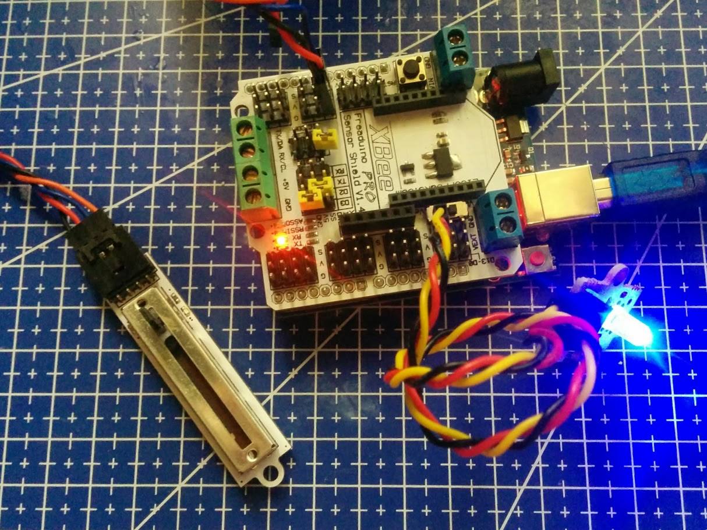

# Sensores

## Controlar la intensidad de brillo de un led con un potencimetro (Led Dimmer)

Conectamos el potenciómetro en A0 (El potenciómetro lineal usa un cable de 4 hilos, de los que sólo usaremos 3, el cuarto es un led que podemos controlar, pero usaremos un led externo) y el led en el pin 11

    // Encendemos con mayor o menor intensidad un led en función del valor de un potenciómetro lineal

    #define pinLed 11

    void setup() {
      // No es necesario establecer el modo INPUT/OUTPUT para entradas analógicas o salidas PWM
    }

    void loop() {

      int valorPot=analogRead(A0);
      int valorPWM=map(valorPot,0,1023,0,255);

      analogWrite(pinLed,valorPWM);
    }

[Ejemplo](./Ejemplos/LedDimmer/LedDimmer.ino)

## Sensor de inclinación

Es analógico

## Sensor de humo (OBMQ05)

[DataSheet](http://elecfreaks.com/estore/download/EF04029-MQ5.pdf)
[Schematic](http://elecfreaks.com/estore/download/EF04029-GAS.pdf)
[wiki](http://www.elecfreaks.com/wiki/index.php?title=Octopus_Smoke_Sensor_MQ-2/MQ-5_Brick)

Es analógico

# Temperatura

Es un sensor analógico, y parece que es un LM35

# Encoder

[Tutorial](http://bildr.org/2012/08/rotary-encoder-arduino/)
[About rotary-encoders](http://playground.arduino.cc/Main/RotaryEncoders)

    //(C)2011 ElecFreaks
    // web: http://www.elecfreaks.com
    //
    // This program is a demo of how to use Octopus Rotary Encoder Brick.
    /
    #include <avr/io.h>

    void  Encoder_san();
    //==============================================
    //Set Encoder pin
    //==============================================
    const int Encoder_A =  19;            // Incremental Encoder singal A is PD3
    const int Encoder_B =  16;            // Incremental Encoder singal B is PD2
    const int ledPin    =  13;
    int Encoder_number=0;
    int state=0;
    //==============================================

    void setup()
    {
    //=============================================  
      PORTD |=((1<<Encoder_A)|(1<<Encoder_B));          //Pull up Encoder singal A and Bsignals
      attachInterrupt(1, Encoder_san, FALLING);        //interrupts: numbers 0 (on digital pin 2) and 1 (on digital pin 3).
    //============================================
      pinMode(ledPin, OUTPUT);      
      // initialize the pushbutton pin as an input:
      pinMode(Encoder_A, INPUT);
      pinMode(Encoder_B, INPUT);
    //============================================    
    }

    void loop()
    {
      if(state==1)
      {  
        for(int i=0;i<Encoder_number;i++)
        {
          digitalWrite(ledPin,HIGH);
          delay(500);
          digitalWrite(ledPin,LOW);
          delay(500);
        }
        state=0;
      }
    }
    void Encoder_san()
    {  

            if(digitalRead(Encoder_B))
              {
                 Encoder_number++;
              }
            else
              {  
                Encoder_number--;
              }     
              state=1;
    }

## Sensor de gases MQ2

Sensor analógico que nos mide la concentración de gases (LPG, i-butane, propane, methane ,alcohol, Hydrogen, smoke)

    ///Arduino Sample Code
    void setup()
    {
      Serial.begin(9600); //Set serial baud rate to 9600 bps
    }
    void loop()
    {
    int val;
    val=analogRead(A2); //Read Gas value from analog 0
    Serial.println(val);//Print the value to serial port
    delay(100);
    }

## PIR

Sensor de presencia, es un sensor digital

    // # Description:
    // # The sketch for using the PIR Motion sensor with Arduino/Raspberry Pi controller to achieve the human detection feature.

    // # Hardware Connection:
    // #        PIR Sensor    -> Digital pin 2
    // #        Indicator LED -> Digital pin 13
    // #

    byte sensorPin = 2;
    byte indicator = 13;

    void setup()
    {
      pinMode(sensorPin,INPUT);
      pinMode(indicator,OUTPUT);
      Serial.begin(9600);
    }

    void loop()
    {
      byte state = digitalRead(sensorPin);
      digitalWrite(indicator,state);
      if(state == 1)Serial.println("Somebody is in this area!");
      else if(state == 0)Serial.println("No one!");
      delay(500);
    }

## Acelerómetro

Un acelerómetro es capaz de leer datos de posición (hay diferentes formas de hacerlo)

Cada modelo se mide de forma distinta, veamos el [HMC5883L](http://www.elecfreaks.com/wiki/index.php?title=Octopus_3-Axis_Digital_Compass_Sensor)
Leeremos los valores y lo convertimos a grados de colores RGB que mostraremos en un led RGB conectado a los pines 10,11 y 12

        // From http://www.elecfreaks.com/wiki/index.php?title=Octopus_3-Axis_Digital_Compass_Sensor
        #include <Wire.h> //I2C Arduino Library

        #define address 0x1E //0011110b, I2C 7bit address of HMC5883

        void setup(){
          //Initialize Serial and I2C communications
          Serial.begin(9600);
          Wire.begin();

          //Put the HMC5883 IC into the correct operating mode
          Wire.beginTransmission(address); //open communication with HMC5883
          Wire.write(0x02); //select mode register
          Wire.write(0x00); //continuous measurement mode
          Wire.endTransmission();
        }

        void loop(){

          int x,y,z; //triple axis data

          //Enviamos el comando de pedir datos
          Wire.beginTransmission(address);
          Wire.write(0x03); //select register 3, X MSB register
          Wire.endTransmission();

         // Leemos los registros, (2 bytes cada uno)
          Wire.requestFrom(address, 6);
          if(6<=Wire.available()){
            x = Wire.read()<<8; //X msb
            x |= Wire.read(); //X lsb
            z = Wire.read()<<8; //Z msb
            z |= Wire.read(); //Z lsb
            y = Wire.read()<<8; //Y msb
            y |= Wire.read(); //Y lsb
          }

          // Imprimimos los datos
          Serial.print("x: ");
          Serial.print(x);
          Serial.print("  y: ");
          Serial.print(y);
          Serial.print("  z: ");
          Serial.println(z);

          // Convertimos los valors al rango de PWM
          int rojo=map(x,-500,500,0,255);
          int azul=map(y,-500,500,0,255);
          int verde=map(z,-500,500,0,255);

          analogWrite(10,rojo);
          analogWrite(11,azul);
          analogWrite(12,verde);

          delay(250);
        }
