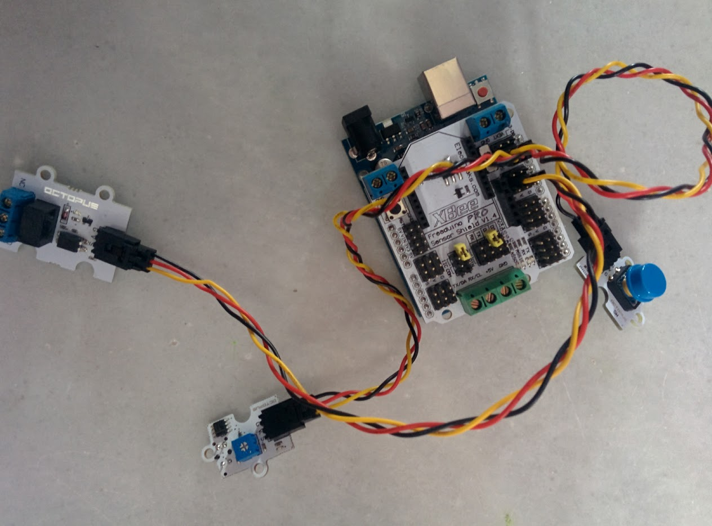

# General

[Lista de componentes de elecfreaks](http://www.elecfreaks.com/wiki/index.php?title=Catalog_category)

# Pulsador

Hay que tener cuidado de que el pulsador no dispone de resistencias pullup ni pulldown lo que hace que tengamos que activar las internas de arduino

En las imágenes en la web de Elekfreaks aparecen con pull-up

# Potenciómetro lineal

Necesita 4 hilos: V+,GND, Señal y un cuarto que nos permite controlar un led que se include en la placa.

# Display 7 segmentos

([ejemplos de Elekfreaks](http://elecfreaks.com/estore/download/EF4056-Paintcode.zip))

Sólo hay que conectar 2 cables a los pines clock y DIO. Si usamos los pines 2 y 3 como en mi caso hay que tener cuidado de que no estén conectados los jumpers del Sensor Shield.

[Librería sencilla TM1637](./Ejemplos/TM1637.zip)

Sólo permite mostrar los 10 números y las letras a b c d e f y controlar el brillo

    //  Author:Frankie.Chu
    //  This library is free software; you can redistribute it and/or
    //  modify it under the terms of the GNU Lesser General Public
    //  License as published by the Free Software Foundation; either
    //  version 2.1 of the License, or (at your option) any later version.
    //
    //  This library is distributed in the hope that it will be useful,
    //  but WITHOUT ANY WARRANTY; without even the implied warranty of
    //  MERCHANTABILITY or FITNESS FOR A PARTICULAR PURPOSE.  See the GNU
    //  Lesser General Public License for more details.
    //
    //  You should have received a copy of the GNU Lesser General Public
    //  License along with this library; if not, write to the Free Software
    //  Foundation, Inc., 51 Franklin St, Fifth Floor, Boston, MA  02110-1301  USA

    #include "TM1637.h"
    #define CLK 2 //pueden usarse cualquier pin
    #define DIO 3
    TM1637 tm1637(CLK,DIO);
    void setup()
    {
      tm1637.init();
      tm1637.set(BRIGHT_TYPICAL);//BRIGHT_TYPICAL = 2,BRIGHT_DARKEST = 0,BRIGHTEST = 7;
    }
    void loop()
    {
      int8_t NumTab[] = {0,1,2,3,4,5,6,7,8,9,10,11,12,13,14,15};//0~9,A,b,C,d,E,F
      int8_t ListDisp[4]; // buffer donde guardaremos lo que se muestra
      unsigned char i = 0;
      unsigned char count = 0;
      delay(150);
      while(1)
      {
        i = count;
        count ++;
        if(count == sizeof(NumTab)) count = 0;
        for(unsigned char BitSelect = 0;BitSelect < 4;BitSelect ++)
        {
          ListDisp[BitSelect] = NumTab[i];
          i ++;
          if(i == sizeof(NumTab)) i = 0;
        }
        tm1637.display(0,ListDisp[0]);
        tm1637.display(1,ListDisp[1]);
        tm1637.display(2,ListDisp[2]);
        tm1637.display(3,ListDisp[3]);
        delay(300);
      }
    }

Existe otra librería más avanzada: [TM1637Display](./Ejemplos/TM1637Display.zip) que nos permite crear caracteres personalizados usando individualmente cada segmentos

Éste sería un Ejemplo

    #include <TM1637Display.h>

    // Module connection pins (Digital Pins)
    #define CLK 2
    #define DIO 3

    // The amount of time (in milliseconds) between tests
    #define TEST_DELAY   500

    // Existen constantes definidas con cada segmento

    const uint8_t SEG_DONE[] = {
    	SEG_B | SEG_C | SEG_D | SEG_E | SEG_G,           // d
    	SEG_A | SEG_B | SEG_C | SEG_D | SEG_E | SEG_F,   // O
    	SEG_C | SEG_E | SEG_G,                           // n
    	SEG_A | SEG_D | SEG_E | SEG_F | SEG_G            // E
    	};

        TM1637Display display(CLK, DIO);

        void setup()
        {
        }

        void loop()
        {
          int k;
          uint8_t data[] = { 0xff, 0xff, 0xff, 0xff };
          display.setBrightness(0x0f);

          // All segments on
          display.setSegments(data);
          delay(TEST_DELAY);

          // Selectively set different digits
          data[0] = 0b01001001;
          data[1] = display.encodeDigit(1);
          data[2] = display.encodeDigit(2);
          data[3] = display.encodeDigit(3);

          for(k = 3; k >= 0; k--) {
        	display.setSegments(data, 1, k); // podemos acceder a los datos por puntero
        	delay(TEST_DELAY);
        	}

          display.setSegments(data+2, 2, 2);
          delay(TEST_DELAY);

          display.setSegments(data+2, 2, 1);
          delay(TEST_DELAY);

          display.setSegments(data+1, 3, 1);
          delay(TEST_DELAY);

          // Show decimal numbers with/without leading zeros
          bool lz = false;
          for (uint8_t z = 0; z < 2; z++) {
        	for(k = 0; k < 10000; k += k*4 + 7) {
        		display.showNumberDec(k, lz);
        		delay(TEST_DELAY);
        	}
        	lz = true;
          }

          // Show decimal number whose length is smaller than 4
          for(k = 0; k < 4; k++)
        	data[k] = 0;
          display.setSegments(data);

          display.showNumberDec(153, false, 3, 1);
          delay(TEST_DELAY);
          display.showNumberDec(22, false, 2, 2);
          delay(TEST_DELAY);
          display.showNumberDec(0, true, 1, 3);
          delay(TEST_DELAY);
          display.showNumberDec(0, true, 1, 2);
          delay(TEST_DELAY);
          display.showNumberDec(0, true, 1, 1);
          delay(TEST_DELAY);
          display.showNumberDec(0, true, 1, 0);
          delay(TEST_DELAY);

          // Brightness Test
          for(k = 0; k < 4; k++)
        	data[k] = 0xff;
          for(k = 0; k < 16; k++) {
            display.setBrightness(k);
            display.setSegments(data);
            delay(TEST_DELAY);
          }

          // Done!
          display.setSegments(SEG_DONE);

          while(1);
        }

## Motor

[vídeo](https://youtu.be/LACQjR5eTk0)

Control del motor con un potenciómetro

Aunque según la especificación el motor funciona a 5v, he tenido problemas consiguiendo que se mueva con este voltaje. He conectado un transformador de 6v  a la alimentación de arduino y funciona perfectamente (con uno de 12v como el del vídeo casi vuela!!!)

    // Usaremos un potenciómetro (A0) para controlar la velocidad del motor (PWM10)

    const int potPin = A0;  // Analog input A0 para el potenciómetro
    const int pwmPin = 10; // Analog (PWM) output pin Para el motor

    void setup() {
      // initializamos las communicationes serie a 9600 bps:
      Serial.begin(9600);
    }

    void loop() {

      int potValue = analogRead(potPin);
      int outputValue = map(potValue, 0, 1023, 0, 255);

      analogWrite(pwmPin, outputValue);

      Serial.print("potenciometro = ");
      Serial.print(potValue);
      Serial.print("\t output = ");
      Serial.println(outputValue);

      // esperamos 2 milliseconds
      delay(2);
    }
    ## Sensor de inclinación

    Es analógico

    ## Sensor de humo (OBMQ05)

    [DataSheet](http://elecfreaks.com/estore/download/EF04029-MQ5.pdf)
    [Schematic](http://elecfreaks.com/estore/download/EF04029-GAS.pdf)
    [wiki](http://www.elecfreaks.com/wiki/index.php?title=Octopus_Smoke_Sensor_MQ-2/MQ-5_Brick)

    Es analógico

    # Temperatura

    Es un sensor analógico, y parece que es un LM35

    # Encoder

    [Tutorial](http://bildr.org/2012/08/rotary-encoder-arduino/)
    [About rotary-encoders](http://playground.arduino.cc/Main/RotaryEncoders)

        //(C)2011 ElecFreaks
        // web: http://www.elecfreaks.com
        //
        // This program is a demo of how to use Octopus Rotary Encoder Brick.
        /
        #include <avr/io.h>

        void  Encoder_san();
        //==============================================
        //Set Encoder pin
        //==============================================
        const int Encoder_A =  19;            // Incremental Encoder singal A is PD3
        const int Encoder_B =  16;            // Incremental Encoder singal B is PD2
        const int ledPin    =  13;
        int Encoder_number=0;
        int state=0;
        //==============================================

        void setup()
        {
        //=============================================  
          PORTD |=((1<<Encoder_A)|(1<<Encoder_B));          //Pull up Encoder singal A and Bsignals
          attachInterrupt(1, Encoder_san, FALLING);        //interrupts: numbers 0 (on digital pin 2) and 1 (on digital pin 3).
        //============================================
          pinMode(ledPin, OUTPUT);      
          // initialize the pushbutton pin as an input:
          pinMode(Encoder_A, INPUT);
          pinMode(Encoder_B, INPUT);
        //============================================    
        }

        void loop()
        {
          if(state==1)
          {  
            for(int i=0;i<Encoder_number;i++)
            {
              digitalWrite(ledPin,HIGH);
              delay(500);
              digitalWrite(ledPin,LOW);
              delay(500);
            }
            state=0;
          }
        }
        void Encoder_san()
        {  

                if(digitalRead(Encoder_B))
                  {
                     Encoder_number++;
                  }
                else
                  {  
                    Encoder_number--;
                  }     
                  state=1;
        }

    ## Sensor de sonido

    Sensor de sonido que compara el nivel de ruido con el potencimetro

        const int SensorPin = 9;     // the number of the Sensor pin
        const int ledPin = 13;      // the number of the led pin

        // variables will change:
        int SensorState = 0;         // variable for reading the Sensor status

        void setup() {
          // initialize the led pin as an output:
          pinMode(ledPin, OUTPUT);      
          // initialize the Sensor pin as an input:
          pinMode(SensorPin, INPUT);     
        }

        void loop(){
          // read the state of the Sensor value:
          SensorState = digitalRead(SensorPin);

          // check if the Sensor is close.
          // if it is, the SensorState is HIGH:
          if (SensorState == HIGH) {     
            // turn led on:    
            digitalWrite(ledPin, HIGH);  
            delay(200);
          }
          else {
            // turn led off:
            digitalWrite(ledPin, LOW);
            delay(200);
          }
        }

    ## Sensor de vibraciones

    Sensor analógico que mide vibraciones

        int inputPin = A0;               

        void setup() {
          pinMode(inputPin, INPUT);     
          Serial.begin(9600);
        }

        void loop(){
          Serial.println(analogRead(inputPin));  // read input value
        }

    ## Sensor de gases MQ2

    Sensor analógico que nos mide la concentración de gases (LPG, i-butane, propane, methane ,alcohol, Hydrogen, smoke)

        ///Arduino Sample Code
        void setup()
        {
          Serial.begin(9600); //Set serial baud rate to 9600 bps
        }
        void loop()
        {
        int val;
        val=analogRead(A2); //Read Gas value from analog 0
        Serial.println(val);//Print the value to serial port
        delay(100);
        }

    ## PIR

    Sensor de presencia, es un sensor digital

        // # Description:
        // # The sketch for using the PIR Motion sensor with Arduino/Raspberry Pi controller to achieve the human detection feature.

        // # Hardware Connection:
        // #        PIR Sensor    -> Digital pin 2
        // #        Indicator LED -> Digital pin 13
        // #

        byte sensorPin = 2;
        byte indicator = 13;

        void setup()
        {
          pinMode(sensorPin,INPUT);
          pinMode(indicator,OUTPUT);
          Serial.begin(9600);
        }

        void loop()
        {
          byte state = digitalRead(sensorPin);
          digitalWrite(indicator,state);
          if(state == 1)Serial.println("Somebody is in this area!");
          else if(state == 0)Serial.println("No one!");
          delay(500);
        }

    ## Acelerómetro

    Un acelerómetro es capaz de leer datos de posición (hay diferentes formas de hacerlo)

    

    Cada modelo se mide de forma distinta, veamos el [HMC5883L](http://www.elecfreaks.com/wiki/index.php?title=Octopus_3-Axis_Digital_Compass_Sensor)
    Leeremos los valores y lo convertimos a grados de colores RGB que mostraremos en un led RGB conectado a los pines 10,11 y 12

            // From http://www.elecfreaks.com/wiki/index.php?title=Octopus_3-Axis_Digital_Compass_Sensor
            #include <Wire.h> //I2C Arduino Library

            #define address 0x1E //0011110b, I2C 7bit address of HMC5883

            void setup(){
              //Initialize Serial and I2C communications
              Serial.begin(9600);
              Wire.begin();

              //Put the HMC5883 IC into the correct operating mode
              Wire.beginTransmission(address); //open communication with HMC5883
              Wire.write(0x02); //select mode register
              Wire.write(0x00); //continuous measurement mode
              Wire.endTransmission();
            }

            void loop(){

              int x,y,z; //triple axis data

              //Enviamos el comando de pedir datos
              Wire.beginTransmission(address);
              Wire.write(0x03); //select register 3, X MSB register
              Wire.endTransmission();

             // Leemos los registros, (2 bytes cada uno)
              Wire.requestFrom(address, 6);
              if(6<=Wire.available()){
                x = Wire.read()<<8; //X msb
                x |= Wire.read(); //X lsb
                z = Wire.read()<<8; //Z msb
                z |= Wire.read(); //Z lsb
                y = Wire.read()<<8; //Y msb
                y |= Wire.read(); //Y lsb
              }

              // Imprimimos los datos
              Serial.print("x: ");
              Serial.print(x);
              Serial.print("  y: ");
              Serial.print(y);
              Serial.print("  z: ");
              Serial.println(z);

              // Convertimos los valors al rango de PWM
              int rojo=map(x,-500,500,0,255);
              int azul=map(y,-500,500,0,255);
              int verde=map(z,-500,500,0,255);

              analogWrite(10,rojo);
              analogWrite(11,azul);
              analogWrite(12,verde);

              delay(250);
            }
    ## Pulsador y detector de final de carrera

    

    Hay que tener cuidado de que el pulsador no dispone de resistencias pullup ni pulldown lo que hace que tengamos que activar las internas de arduino

    Al usar las pull-up internas nos encontramos con que el valor por defecto es High y al pulsar down!!!

        int boton=12;
        int detector=11;

        int rele_motor=9;

        void setup() {
        pinMode(boton,INPUT_PULLUP);
        pinMode(detector,INPUT);
        pinMode(rele_motor,OUTPUT);

        Serial.begin(9600);
        }

        void loop() {

          int estadoBoton=digitalRead(boton);
          int estadoDetector=digitalRead(detector);
          Serial.print("Boton:");
          Serial.print(estadoBoton);
          Serial.print(" Detector:");
          Serial.println(estadoDetector);

          if(estadoBoton==LOW) // Hemos pulsado el boton
          {
            delay(50);
            if(estadoDetector==LOW)  // El detector no detecta el fin de la persiana
            {
              digitalWrite(rele_motor,HIGH);
            }
            else
            {
              digitalWrite(rele_motor,LOW);
            }
          }
          else
          {
            delay(50);
            digitalWrite(rele_motor,LOW);
          }
        }

        # Ejemplos avanzados

        ## Controlar la intensidad de brillo de un led con un potencimetro (Led Dimmer)

        

        Conectamos el potenciómetro en A0 (El potenciómetro lineal usa un cable de 4 hilos, de los que sólo usaremos 3, el cuarto es un led que podemos controlar, pero usaremos un led externo) y el led en el pin 11

            // Encendemos con mayor o menor intensidad un led en función del valor de un potenciómetro lineal

            #define pinLed 11

            void setup() {
              // No es necesario establecer el modo INPUT/OUTPUT para entradas analógicas o salidas PWM
            }

            void loop() {

              int valorPot=analogRead(A0);
              int valorPWM=map(valorPot,0,1023,0,255);

              analogWrite(pinLed,valorPWM);
            }

        [Ejemplo](./Ejemplos/LedDimmer/LedDimmer.ino)
