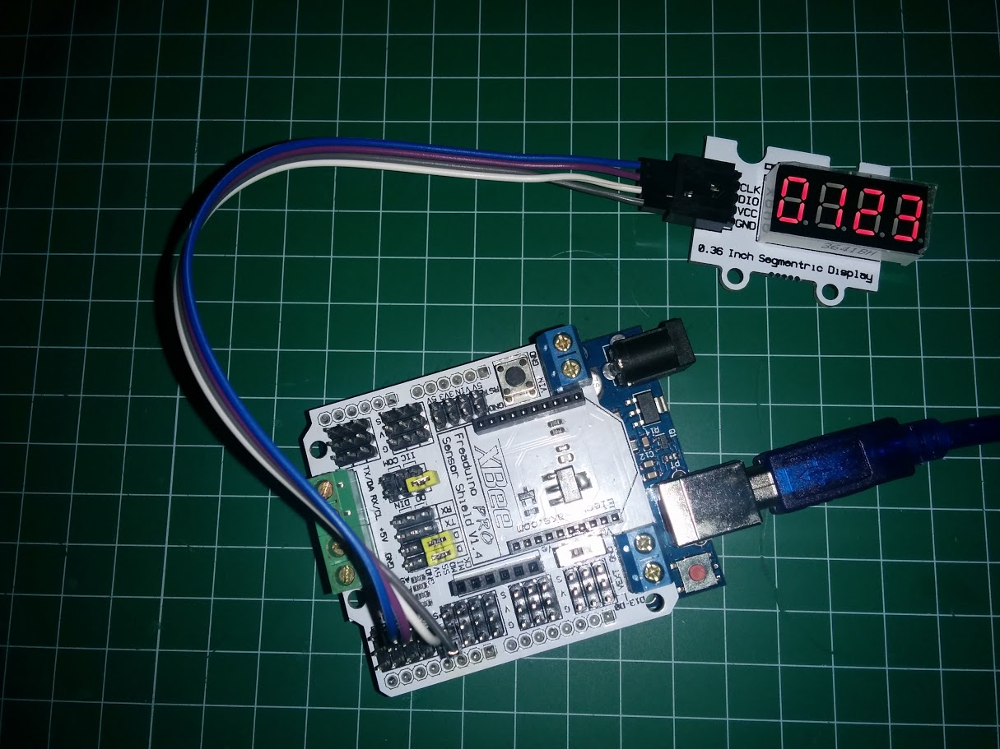

# General

[Lista de componentes de elecfreaks](http://www.elecfreaks.com/wiki/index.php?title=Catalog_category)

# Pulsador

Hay que tener cuidado de que el pulsador no dispone de resistencias pullup ni pulldown lo que hace que tengamos que activar las internas de arduino

En las imágenes en la web de Elekfreaks aparecen con pull-up

# Potenciómetro lineal

Necesita 4 hilos: V+,GND, Señal y un cuarto que nos permite controlar un led que se include en la placa.

# Display 7 segmentos

([ejemplos de Elekfreaks](http://elecfreaks.com/estore/download/EF4056-Paintcode.zip))

Sólo hay que conectar 2 cables a los pines clock y DIO. Si usamos los pines 2 y 3 como en mi caso hay que tener cuidado de que no estén conectados los jumpers del Sensor Shield.

[Librería sencilla TM1637](./Ejemplos/TM1637.zip)

Sólo permite mostrar los 10 números y las letras a b c d e f y controlar el brillo

    //  Author:Frankie.Chu
    //  This library is free software; you can redistribute it and/or
    //  modify it under the terms of the GNU Lesser General Public
    //  License as published by the Free Software Foundation; either
    //  version 2.1 of the License, or (at your option) any later version.
    //
    //  This library is distributed in the hope that it will be useful,
    //  but WITHOUT ANY WARRANTY; without even the implied warranty of
    //  MERCHANTABILITY or FITNESS FOR A PARTICULAR PURPOSE.  See the GNU
    //  Lesser General Public License for more details.
    //
    //  You should have received a copy of the GNU Lesser General Public
    //  License along with this library; if not, write to the Free Software
    //  Foundation, Inc., 51 Franklin St, Fifth Floor, Boston, MA  02110-1301  USA

    #include "TM1637.h"
    #define CLK 2 //pueden usarse cualquier pin
    #define DIO 3
    TM1637 tm1637(CLK,DIO);
    void setup()
    {
      tm1637.init();
      tm1637.set(BRIGHT_TYPICAL);//BRIGHT_TYPICAL = 2,BRIGHT_DARKEST = 0,BRIGHTEST = 7;
    }
    void loop()
    {
      int8_t NumTab[] = {0,1,2,3,4,5,6,7,8,9,10,11,12,13,14,15};//0~9,A,b,C,d,E,F
      int8_t ListDisp[4]; // buffer donde guardaremos lo que se muestra
      unsigned char i = 0;
      unsigned char count = 0;
      delay(150);
      while(1)
      {
        i = count;
        count ++;
        if(count == sizeof(NumTab)) count = 0;
        for(unsigned char BitSelect = 0;BitSelect < 4;BitSelect ++)
        {
          ListDisp[BitSelect] = NumTab[i];
          i ++;
          if(i == sizeof(NumTab)) i = 0;
        }
        tm1637.display(0,ListDisp[0]);
        tm1637.display(1,ListDisp[1]);
        tm1637.display(2,ListDisp[2]);
        tm1637.display(3,ListDisp[3]);
        delay(300);
      }
    }

Existe otra librería más avanzada: [TM1637Display](./Ejemplos/TM1637Display.zip) que nos permite crear caracteres personalizados usando individualmente cada segmentos

Éste sería un Ejemplo

    #include <TM1637Display.h>

    // Module connection pins (Digital Pins)
    #define CLK 2
    #define DIO 3

    // The amount of time (in milliseconds) between tests
    #define TEST_DELAY   500

    // Existen constantes definidas con cada segmento

    const uint8_t SEG_DONE[] = {
    	SEG_B | SEG_C | SEG_D | SEG_E | SEG_G,           // d
    	SEG_A | SEG_B | SEG_C | SEG_D | SEG_E | SEG_F,   // O
    	SEG_C | SEG_E | SEG_G,                           // n
    	SEG_A | SEG_D | SEG_E | SEG_F | SEG_G            // E
    	};

        TM1637Display display(CLK, DIO);

        void setup()
        {
        }

        void loop()
        {
          int k;
          uint8_t data[] = { 0xff, 0xff, 0xff, 0xff };
          display.setBrightness(0x0f);

          // All segments on
          display.setSegments(data);
          delay(TEST_DELAY);

          // Selectively set different digits
          data[0] = 0b01001001;
          data[1] = display.encodeDigit(1);
          data[2] = display.encodeDigit(2);
          data[3] = display.encodeDigit(3);

          for(k = 3; k >= 0; k--) {
        	display.setSegments(data, 1, k); // podemos acceder a los datos por puntero
        	delay(TEST_DELAY);
        	}

          display.setSegments(data+2, 2, 2);
          delay(TEST_DELAY);

          display.setSegments(data+2, 2, 1);
          delay(TEST_DELAY);

          display.setSegments(data+1, 3, 1);
          delay(TEST_DELAY);

          // Show decimal numbers with/without leading zeros
          bool lz = false;
          for (uint8_t z = 0; z < 2; z++) {
        	for(k = 0; k < 10000; k += k*4 + 7) {
        		display.showNumberDec(k, lz);
        		delay(TEST_DELAY);
        	}
        	lz = true;
          }

          // Show decimal number whose length is smaller than 4
          for(k = 0; k < 4; k++)
        	data[k] = 0;
          display.setSegments(data);

          display.showNumberDec(153, false, 3, 1);
          delay(TEST_DELAY);
          display.showNumberDec(22, false, 2, 2);
          delay(TEST_DELAY);
          display.showNumberDec(0, true, 1, 3);
          delay(TEST_DELAY);
          display.showNumberDec(0, true, 1, 2);
          delay(TEST_DELAY);
          display.showNumberDec(0, true, 1, 1);
          delay(TEST_DELAY);
          display.showNumberDec(0, true, 1, 0);
          delay(TEST_DELAY);

          // Brightness Test
          for(k = 0; k < 4; k++)
        	data[k] = 0xff;
          for(k = 0; k < 16; k++) {
            display.setBrightness(k);
            display.setSegments(data);
            delay(TEST_DELAY);
          }

          // Done!
          display.setSegments(SEG_DONE);

          while(1);
        }

## Motor

[vídeo](https://youtu.be/LACQjR5eTk0)

Control del motor con un potenciómetro

Aunque según la especificación el motor funciona a 5v, he tenido problemas consiguiendo que se mueva con este voltaje. He conectado un transformador de 6v  a la alimentación de arduino y funciona perfectamente (con uno de 12v como el del vídeo casi vuela!!!)

    // Usaremos un potenciómetro (A0) para controlar la velocidad del motor (PWM10)

    const int potPin = A0;  // Analog input A0 para el potenciómetro
    const int pwmPin = 10; // Analog (PWM) output pin Para el motor

    void setup() {
      // initializamos las communicationes serie a 9600 bps:
      Serial.begin(9600);
    }

    void loop() {

      int potValue = analogRead(potPin);
      int outputValue = map(potValue, 0, 1023, 0, 255);

      analogWrite(pwmPin, outputValue);

      Serial.print("potenciometro = ");
      Serial.print(potValue);
      Serial.print("\t output = ");
      Serial.println(outputValue);

      // esperamos 2 milliseconds
      delay(2);
    }
