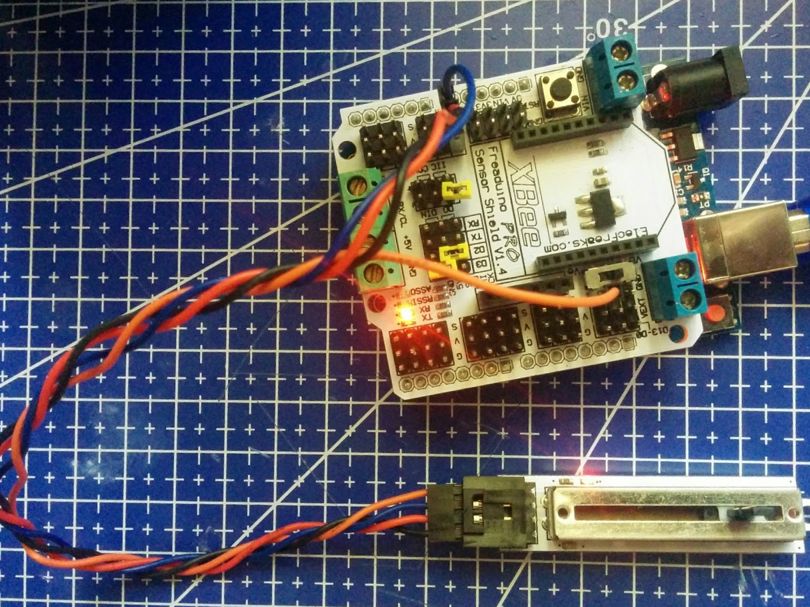

# General

[Lista de componentes de elecfreaks](http://www.elecfreaks.com/wiki/index.php?title=Catalog_category)

# Potenciómetro lineal

Necesita 4 hilos: V+,GND, Señal y un cuarto que nos permite controlar un led que se include en la placa.

# Display 7 segmentos

    #include "TM1637.h"
    #define CLK 2//pins definitions for TM1637 and can be changed to other ports       
    #define DIO 3
    TM1637 tm1637(CLK,DIO);
    #define ON 1
    #define OFF 0
    unsigned char ClockPoint = 1;
    void setup()
    {
      tm1637.init();
      tm1637.set(BRIGHT_TYPICAL);//BRIGHT_TYPICAL = 2,BRIGHT_DARKEST = 0,BRIGHTEST = 7;
    }
    void loop()
    {
      int8_t NumTab[] = {0,1,2,3,4,5,6,7,8,9,10,11,12,13,14,15};//0~9,A,b,C,d,E,F
      int8_t ListDisp[0];
      tm1637.display(0,8);
      tm1637.display(1,8);
      tm1637.display(2,8);
      tm1637.display(3,8);
      tm1637.point(POINT_ON);
      delay(300);
      tm1637.clearDisplay();
      tm1637.point(POINT_OFF);
      delay(300);
    }
