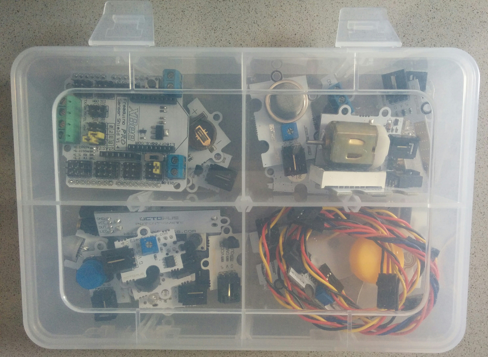
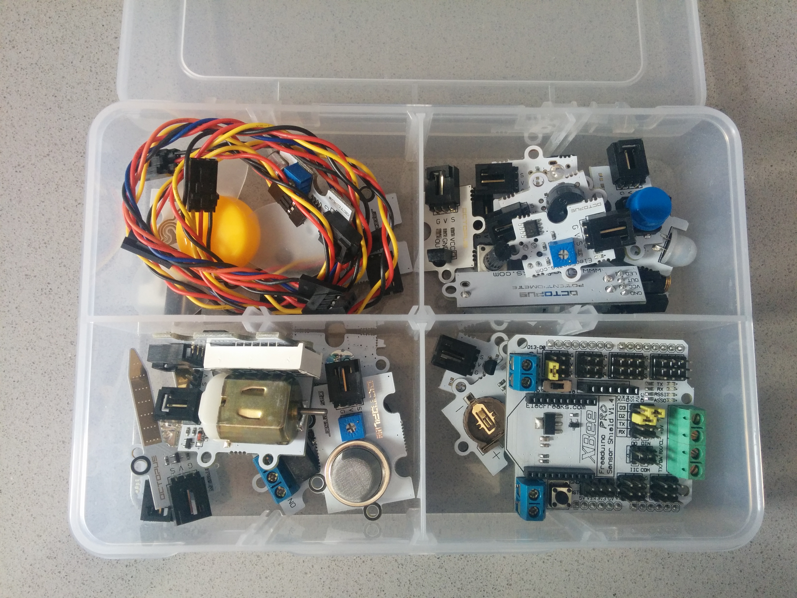
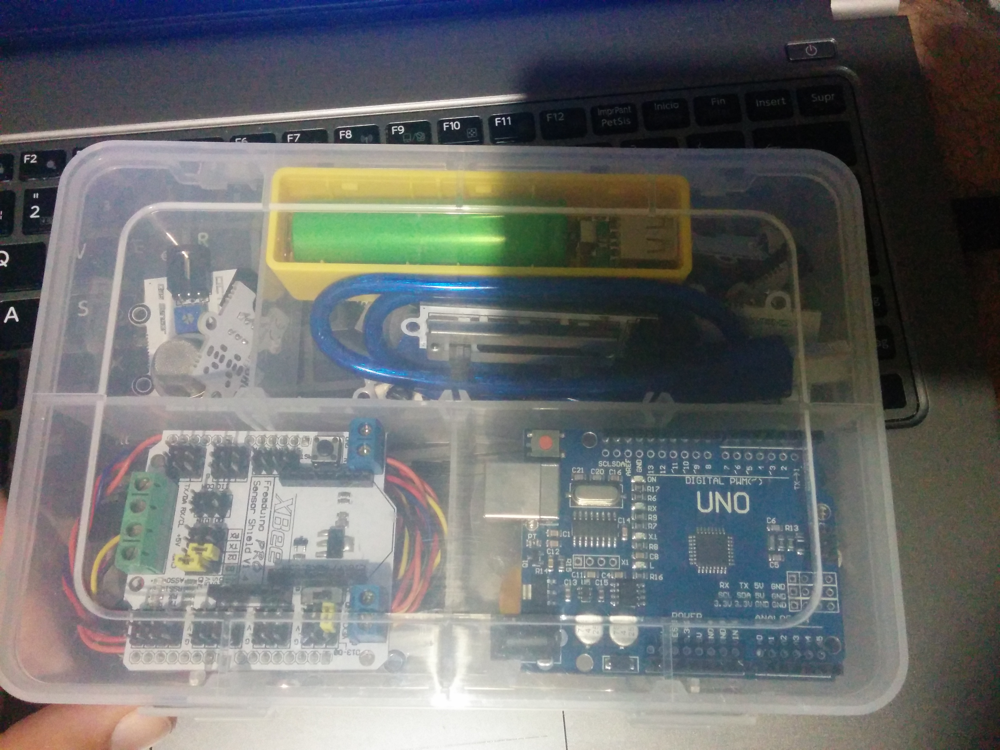
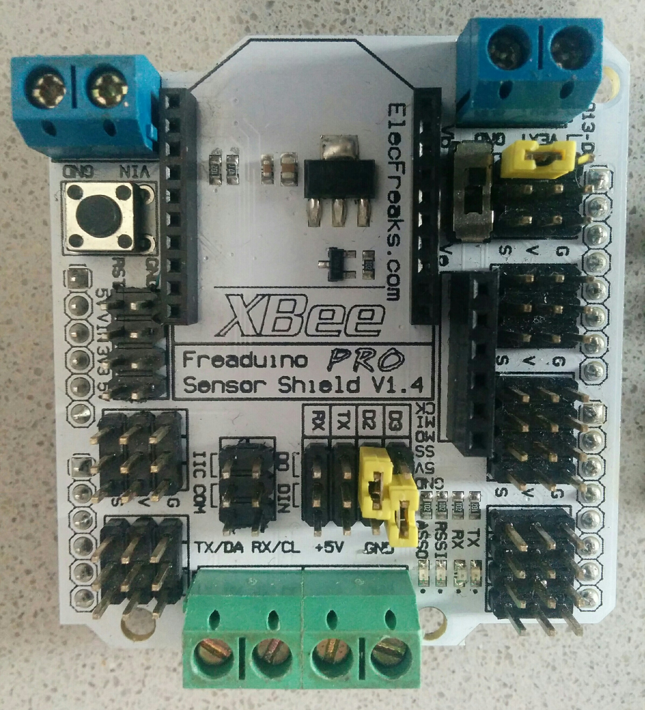
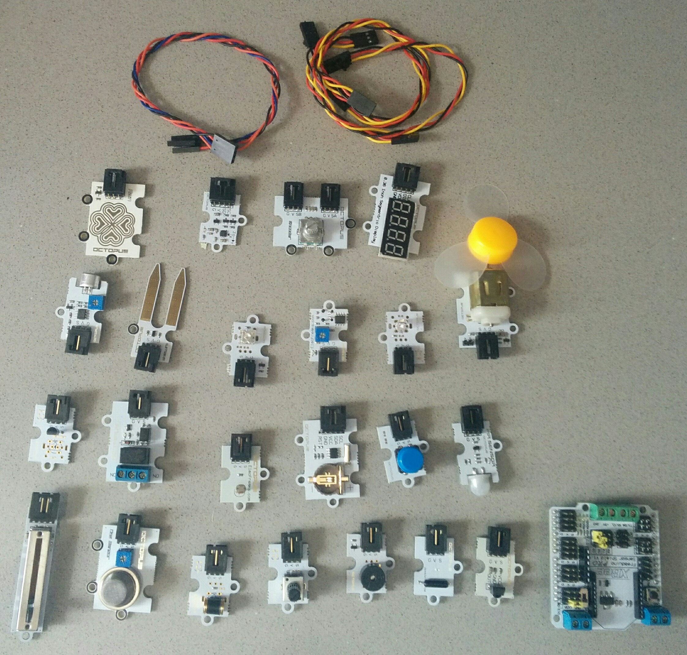
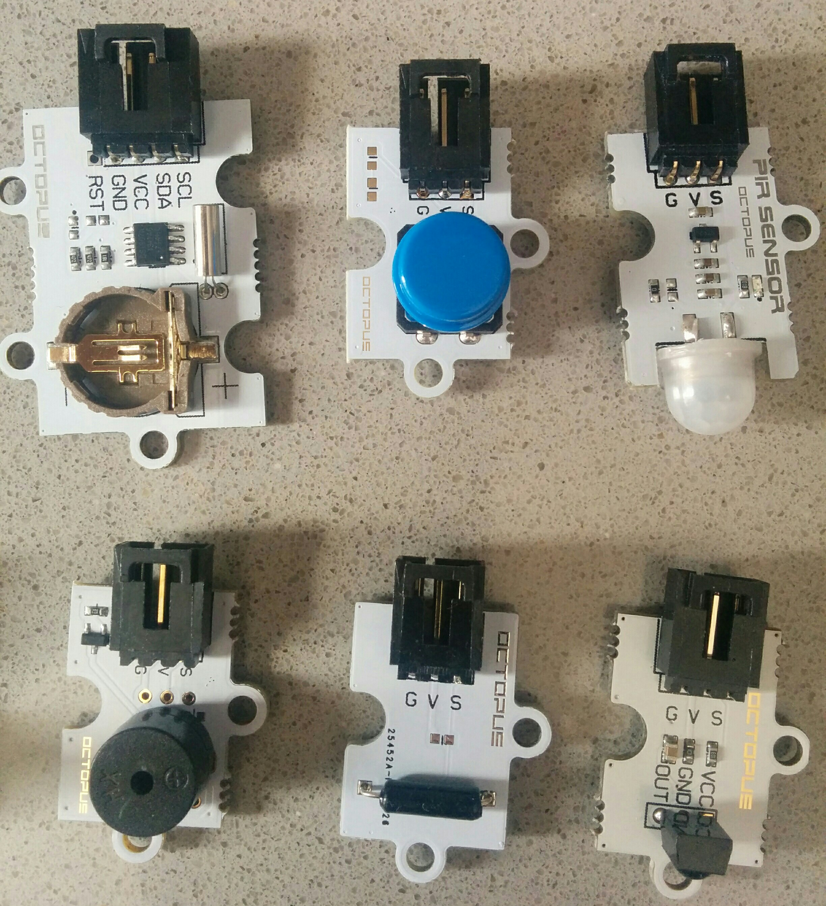
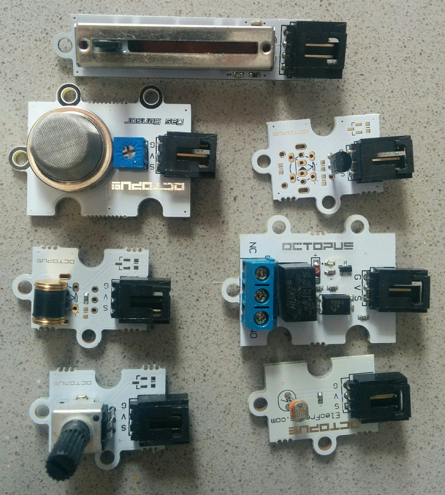
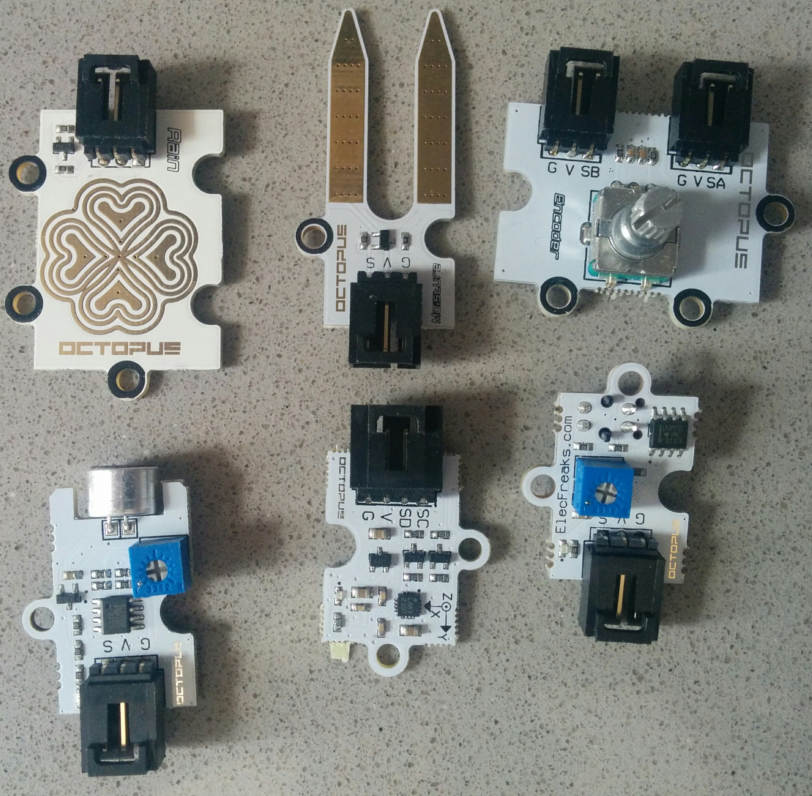
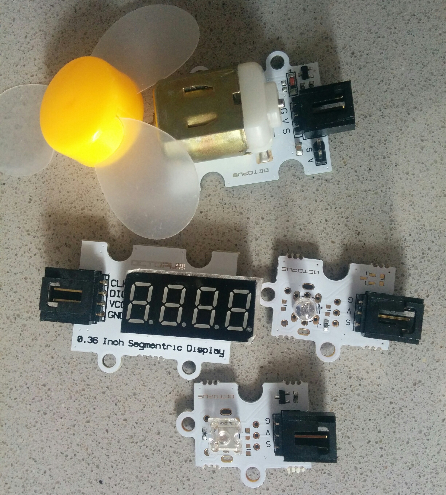
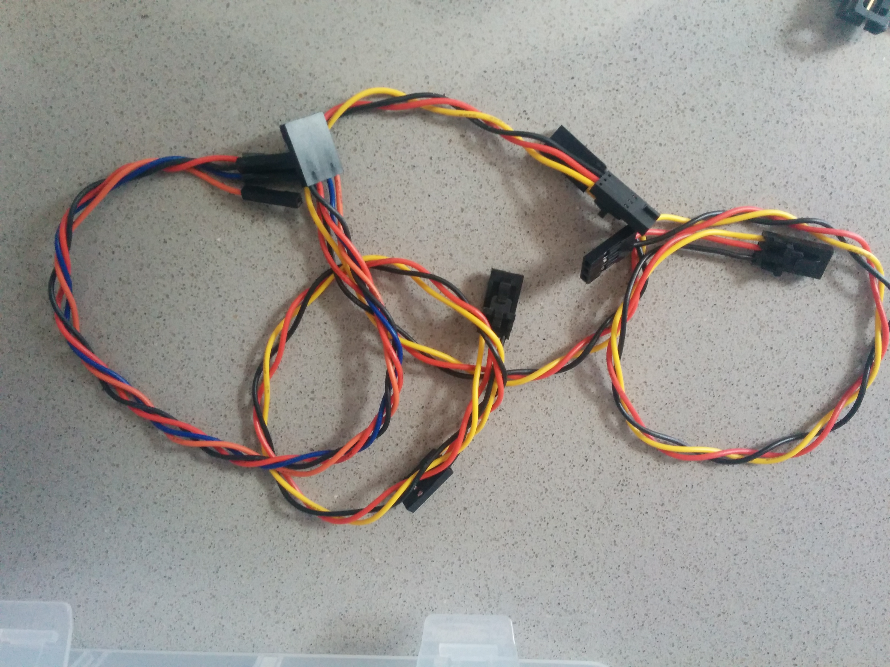

[Bricogeek](http://www.bricogeek.com) me ha enviado un
[Octopus Brick - Kit de 24 sensores para Arduino de Elekfreaks](http://tienda.bricogeek.com/kits-arduino/830-octopus-brick-kit-de-24-sensores-para-arduino.html) para que lo pueda probar.

[Video review](https://www.youtube.com/watch?v=AbCZv3wwrck&feature)

Un primer vistazo nos permite ver que se trata de un kit serio, nada que ver con los kits con unos pocos leds y pulsadores que solemos ver.

Se trata de un kit de 24 components con un sistema de conexión de 3 cables que nos facilita enormemente el uso. Este tipo de conexión se adapta perfectamente a placas que dispone de sistema conenexiones de 3-pines, como la Freaduino y Zum y que permite hacer montajes complejos sin usar una protoboard.

Sobre la caja:
* Es robusta
* Podemos modificar su distribución
* Los sensores caben fácilmente (y sin tener que jugar al tetris para colocarlos) lo que es de agradecer
* Tiene algo de espacio libre, lo que me ha permitido meter más cables, un powerbank y un arduino UNO con su cable USB!

## Shield

El kit incluye un shield  que  nos permite:
* Usar este sistema de conexión de 3 hilos en placas Arduino _normales_ de tipo Arduino UNO
* Conectar una placa XBee/Zigbee
* Usar una alimentación exterior o la de Arduino, por medio de conectores externos y un selector
* Conector de tipo cable SPI

## Componentes

Estos son todos los componentes del kit:
* Sensor Shield v1.4 de Elecfreaks
* 23 Sensores/Componentes
* 3 Cables de 3 hilos
* 1 Cable de 4 hilos (para las conexiones tipo I2C)

Veamos en detalle los sensores

|[Octopus Reloj en tiempo real RTC](http://www.elecfreaks.com/wiki/index.php?title=Octopus_Real-time_Clock)|[Octopus pulsador digital](http://www.elecfreaks.com/wiki/index.php?title=Octopus_Digital_PushButton_Brick)|[Octopus Sensor PIR](http://www.elecfreaks.com/wiki/index.php?title=Octopus_PIR_sensor_Brick)|
|---|---|---|
|[Octopus zumbador OBPB01](http://www.elecfreaks.com/wiki/index.php?title=Octopus_Passive_buzzer_Brick)|Octopus Sensor de inclinación|[Octopus Receptor infrarojo](http://www.elecfreaks.com/wiki/index.php?title=Octopus_Infrared_Receiver_Sensor)|

|[Octopus Potenciómetro lineal tipo Slide](http://www.elecfreaks.com/wiki/index.php?title=Octopus_Linear_Slider_Potentiometer_Brick)||
|---|---|
|[Octopus Sensor de gases MQ-5](http://www.elecfreaks.com/wiki/index.php?title=Octopus_Smoke_Sensor_MQ-2/MQ-5_Brick)|Octopus Sensor analógico de temperatura|
|[Octopus detector de vibraciones OBVD01](http://www.elecfreaks.com/wiki/index.php?title=Octopus_Vibration_Detection_Brick)|[Octupus relé](http://www.elecfreaks.com/wiki/index.php?title=Octopus_1Channel_Relay)|
|[Octopus Encoder OBARot](http://www.elecfreaks.com/wiki/index.php?title=Octopus_Analog_Rotation_Brick)|[Octopus sensor de luz analógico LDR](http://www.elecfreaks.com/wiki/index.php?title=Octopus_Analog_Photocell_Brick)|

|[Octopus Sensor de lluvia](http://www.elecfreaks.com/wiki/index.php?title=Octopus_Rain-Steam_Sensor)|[Octopus Sensor de humedad del suelo](http://www.elecfreaks.com/wiki/index.php?title=Octopus_Soil_Moisture_Sensor_Brick)|[Octopus encoder OBEncode](http://www.elecfreaks.com/wiki/index.php?title=Octopus_Rotary_Encoder_Brick)|
|---|---|---|
|[Octopus Sensor de sonido](http://www.elecfreaks.com/wiki/index.php?title=Octopus_Sound_Sensor)|[Octopus Compás digital de 3 ejes](http://www.elecfreaks.com/wiki/index.php?title=Octopus_3-Axis_Digital_Compass_Sensor)|[Octopus Emisor/Receptor IR TCRT5000](http://www.elecfreaks.com/wiki/index.php?title=Octopus_Hant_Sensor)|

|[Octopus Motor](http://www.elecfreaks.com/wiki/index.php?title=Octopus_Motor_Brick) con una graciosa hélice de plástico||
|---|---|
|[Octopus 0.36'' 7 segmentos (4 dígitos)](http://www.elecfreaks.com/wiki/index.php?title=Octopus_0.36%22_Segment_LED_Brick) control con 2 hilos|[Octopus LED 5mm Brick](http://www.elecfreaks.com/wiki/index.php?title=Octopus_5mm_LED_Brick)|
|[Octopus LED Piranha](http://www.elecfreaks.com/wiki/index.php?title=Octopus_Piranha_LED_Brick)||

[Shield de conexiones](./SensorShield.md) "Sensor Shield" con conexión para XBee

* 3 x Cables de 3 hilos
* Cable de 4 hilos

(Los enlaces a la documentación y ejemplos están en la [página del producto en bricogeek](http://tienda.bricogeek.com/kits-arduino/830-octopus-brick-kit-de-24-sensores-para-arduino.html))

## [Proyectos](./proyectos.md)

En esta sección veremos algunos proyectos para realizar con este kit

## [Ejemplos](./Ejemplos.md)

En "Ejemplos" reuniremos algunos fragmentos de código y detalles para usar los componentes.

## Resumen

Un excelente kit con una colección muy interesante de 24 componentes que nos permite conectar directamente a nuestra Arduino UNO de una manera muy sencilla

Por ponerle algún _pero_, echo en falta:
* Más cables de 3 hilos
* Sensor de temperatura y humedad tipo DHT22, es un clásico de este tipo de proyectos
* Una pila para el RTC
