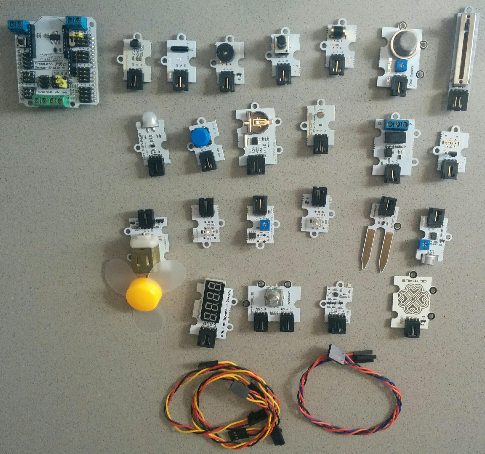
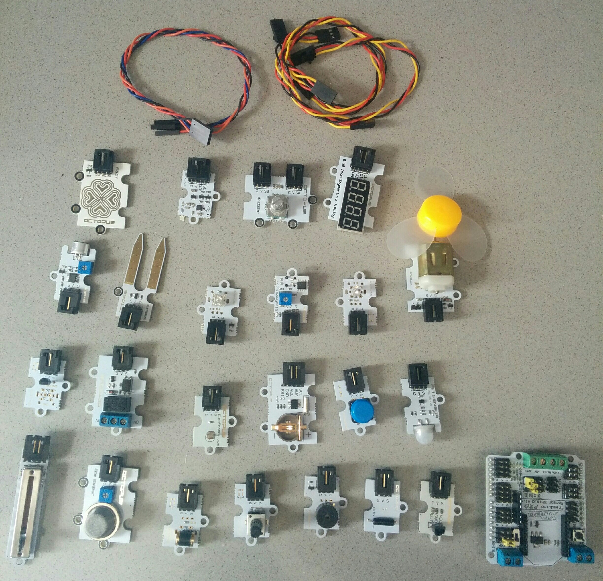

[Bricogeek] me ha enviado un
[Octopus Brick - Kit de 24 sensores para Arduino de Elekfreaks](http://tienda.bricogeek.com/kits-arduino/830-octopus-brick-kit-de-24-sensores-para-arduino.html) para que lo pueda probar.

Un primer vistazo nos permite ver que se trata de un kit serio, nada que ver con los kits con unos pocos leds y pulsadores que solemos ver.

Se trata de un kit de 24 components con un sistema de conexión de 3 cables que nos facilita enormemente el uso. Este tipo de conexión se adapta perfectamente a placas que dispone de sistema conenexiones de 3-pines, como la ~~Freaduino~~ y Zum y que permite hacer montajes complejos sin usar una protoboard.

Sobre la caja:
* Es robusta
* Podemos modificar su distribución
* Los sensores caben fácilmente (y sin tener que jugar al tetris para colocarlos) lo que es de agradecer
* Tiene algo de espacio libre, lo que me ha permitido meter más cables, un powerbank y un arduino UNO con su cable USB!

## Shield

El kit incluye un shield  que  nos permite:
* Usar este sistema de conexión de 3 hilos en placas Arduino _normales_ de tipo Arduino UNO
* Conectar una placa XBee/Zigbee
* Usar una alimentación exterior o la de Arduino, por medio de conectores externos y un selector
* Conector de tipo cable ~~¿FTDI o SPI?~~

## Componentes

Estos son todos los componentes del kit:
* Sensor Shield v1.4 de Elecfreaks
* 23 Sensores/Componentes
* 3 Cables de 3 hilos
* 1 Cable de 4 hilos (para las conexiones tipo I2C)

Veamos en detalle los sensores

* Octopus Sensor PIR
* Octopus Reloj en tiempo real RTC

* Octopus Potenciómetro lineal tipo Slider
* Octopus Sensor de humo MQ-5
* Octupus relé

     
    
      

* Octopus LED Piranha
* Octopus LED 5mm Brick
* Octopus 0.36'' 7 segmentos (4 dígitos) que necesita sólo 2 hilos para controlarse
*  Octopus Motor con una graciosa hélice de plástico
1 x Octopus Sensor de humedad del suelo
1 x Octopus Receptor infrarojo
1 x Octopus Emisor/Receptor IR TCRT5000
1 x Octopus Sensor de sonido
1 x Octopus Sensor de inclinación
1 x Octopus Sensor analógico de temperatura

1 x Octopus Encoder OBARot
1 x Octopus detector de vibraciones OBVD01

1 x Octopus Sensor de luvia
1 x Octopus Compas digital de 3 ejes

1 x Octopus zumbador OBPB01
1 x Octopus encoder OBEncoder
1 x Octopus pulsador digital
1 x Octopus sensor de luz analógico LDR

* Shield de conexiones Sensor Shield con conexión para XBee

* 3 x Cables de 3 hilos
* Cable de 4 hilos

(Los enlaces a la documentación y ejemplos están en la [página del producto en bricogeek](http://tienda.bricogeek.com/kits-arduino/830-octopus-brick-kit-de-24-sensores-para-arduino.html))

## Resumen

Un excelente kit con una colección muy interesante de 24 sensores que nos permite conectar directamente a nuestra Arduino UNO de una manera muy sencilla

Por ponerle algún pero, echo en falta:
* Más cables de 3 hilos
* Sensor de temperatura y humedad tipo DHT22, es un clásico de este tipo de proyectos
* Una pila para el RTC
